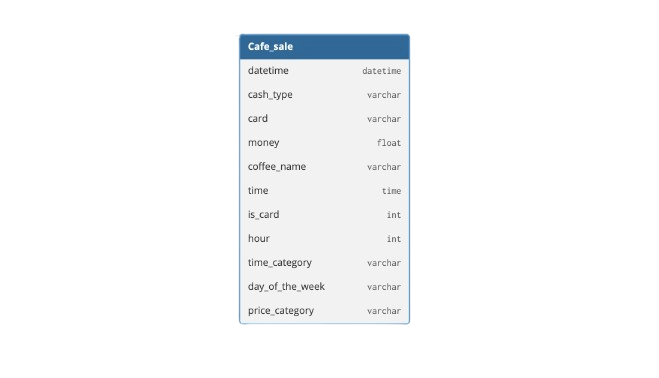

# **Vending Machine Sales Performance Analysis - 2025**
## **Table of content**
- [Project Background](#project-background)
- [Data Structure](#data-structure)
- [Executive Summary](#executive-summary)
  - [Overview and Finds](#_overview-of-findings_)
- [Insights Deep Dive](#insights-deep-dive)
  - [Peak hours and Sales trends](#peak-hours-and-sales-trends)
  - [Customer Frequency, Contribution and Retention](#customer-frequency-contribution-and-retention)
  - [Card payments vs Cash payments](#card-payments-vs-cash-payments)
- [Recommendations](#recommendations)
- [Assumptions and Caveats](#assumptions-and-caveats)

## **Project Background:**
This dataset contains detailed records of coffee sales from a Vending Machine. It is intended for analysis of purchasing patterns, sales trends, and customer preferences related to coffee products.
The ultimate goal was to leverage this analysis to inform strategic decisions regarding Vending Machine Sales and Trends for the Operations/Service team. The Vending Machine has significant data on its sales, coffee types, and transaction types. This project thoroughly analyzes and synthesizes this data to uncover critical insights that will improve the Vending Machine sales which will ensure its commercial success.

Insights and Recommendations are provided for the following areas:
- **Choice of Drinks**: Analysis of customer preferences and purchasing patterns across different time frames to identify popular items and optimize inventory.
- **Sale Distribution**: Examination of sales trends, including peak and low periods, to better understand transaction patterns and inform staffing or stocking strategies.
- **AOV Analysis During Holiday Seasons**: Assessment of fluctuations in both transaction frequency and AOV before, during, and after holiday periods, highlighting seasonal impacts on sales.
- **Customer Cohort Analysis**: Insights indicate low customer retention, with repeat visits declining sharply.
- **Card Payments vs. Cash Payments**: Analysis of transaction trends and customer behavior following the discontinuation of cash payments, including impacts on frequency and AOV.

An interactive **Tableau Dashboard** can be used [here](https://public.tableau.com/views/VendingMachineSalesPerformanceAnalysis-2025_17579857198010/Dashboard1?:language=en-US&:sid=&:redirect=auth&:display_count=n&:origin=viz_share_link).

The **Jupyter Notebook** used to clean, organize and prepare data for the dashboard can be found [here](https://github.com/omer3bd/Vending-Machine-Sales-Performance-Analysis---2025/blob/main/Vending%20Machine%20Sales%20Performance%20Analysis%20-%202025.ipynb).

## **Data Structure**

The vending machine dataset as seen above consists **of one table**: datetime, cash_type, card, money	coffee_name, time, is_card, hour, time_category, day_of_the_week, price_category
with a **total row count of 3,636 records**.

## Executive Summary
### _Overview of Findings:_
This vending machine analysis from 2024 to 2025 reveals its hourly performance shows **peak demand** in the mid-morning and a **secondary spike at 19:00 for cappuccino**. The customer AOV and retention patterns reveals that **revenue is heavily concentrated among a small number of repeat customers**. While some individuals demonstrate high visit frequency, their average order value tends to be lower. The AOV reached its lowest point in 2024 on August 25 at \$27, followed by a gradual recovery to \$30–\$33 by October 13, 2024. Since then, AOV has remained stable through the 2025 year. A critical concern is the consistently low customer retention, with cohorts showing a sharp drop-off after over the first month. Overall vending machine transactions declined significantly between November 24, 2024, and January 19, 2025, coinciding with holidays and winter breaks. 

Below is the page from tableau dashboard and more examples are included throughout the report. The entire interactive dashboard can be used [here].(https://public.tableau.com/views/VendingMachineSalesPerformanceAnalysis-2025_17579857198010/Dashboard1?:language=en-US&:sid=&:redirect=auth&:display_count=n&:origin=viz_share_link).

## **Insights Deep Dive**
### Peak hours and Sales trends:
- **The vending machine peaks its sales at 10pm of 9.6% sales in working hours of a day with 349 orders totaling $100,995 in revenue**. This is likely due to it being during the rush hours of the day. Many workplaces, schools, and public buildings have a morning routine: **people arrive around 8–9:00 in the morning**, start working, and then take a short break mid-morning to stretch and grab a coffee. **The top performing choices of drinks are Americano with Milk and Latte**.
- **At opening and closing hours (6:00 to 22:00) the sales are at the lowest being 0.1% and 3.1% respectively**. the declined revenue being 5 sales generating \$149 and 116 sales generating \$3,747 respectively. The early hours offices and schools are experiencing minimal occupancy. In the late hours the majority of daily activity has concluded, and the premises have largely vacated and headed home. **The Least performing choice of drink is espresso**.
- **Sales of cappuccino remain largely stable throughout the day, with minimal variation. However, a pronounced increase occurs at 19:00**, when cappuccino sales reach its daily peak, **accounting for approximately 10% of total sales during the machine’s operating hours**.This may be attributable to its taste and dessert like quality, functioning as a light beverage, making it attractive after dinner and for social meet-ups.
- **Cocoa sales remain consistent throughout the vending machine’s operating hours, showing no significant fluctuations in sales**. This may be explained by stable customer preferences. Cocoa contains little or no caffeine, making it suitable at any time of day, unlike coffee drinks that may be avoided late in the evening. **The average price has been in the range of \$32 - \$40**.

### Customer frequency, contribution and retention:
- Among the top five repeat customers, **the highest recorded frequency was 129 visits by a single customer, while the fifth-ranked customer recorded 67 visits**. The substantial gap between the highest repeat-customer frequency (129 visits) and the fifth-ranked frequency (67 visits) suggests that **a small number of customers account for a disproportionately large share of transactions**. Several factors may explain this difference: Work Schedule, Personal preference and Limited Competition.
- Within the same top five customers by visit frequency, **the highest ranking customer records an Average Order Value (AOV) of $29, whereas the fifth-ranking customer records a higher average ticket of \$35**. The top customer likely buys cheaper items but more often, resulting in a lower average per transaction. Comparatively the fifth-ranked customer may visit less frequently but tends to purchase multiple items or higher-priced beverages per visit.
- Customer retention is currently low. **The cohort recorded 117 visits in January 2025, which declined sharply to 8 visits in February 2025**. A similar pattern is observed throughout all months of 2024, indicating a consistent trend of rapid drop-off in repeat customer activity.

### Card payments vs Cash payments:
- **Transactions conducted via card have exhibited a steady upward trend, reaching a peak of 110 transactions in the week of October 6, 2024**. While there was a temporary dip on **August 25, 2024**, with only **32 transactions**, activity quickly recovered in the subsequent period leading up to the peak.

- **Vending machine transactions experienced a notable decline, remaining consistently low from November 24, 2024, to January 19, 2025**. Consequently, the opening period of 2025 reflected limited sales activity. This period includes late November, December, and early January, coinciding with holidays and winter breaks in schools, offices, and other public facilities. Reduced foot traffic naturally leads to lower sales during the holiday seasons.

- **A discontinuation of cash payments is observed after June 2, 2024**. Consequently, the Average Order Value (AOV) for cash transactions also shows a corresponding cutoff for cash transactions from the same date onward. This trend is likely the result of the vending machine being out of service.

- **Cash payments were discontinued, and while transaction frequency remained relatively constant, the Average Order Value (AOV) experienced a decline from \$37 to \$34**. This decrease is likely attributable to customers purchasing lower-priced items, such as smaller drinks.

- **The Vending Machine AOV reached its lowest point for 2024 on August 25** recording an average **transaction value of \$27**. Following this period, we saw a gradual increase in AOV, reaching approximately **\$30–\$33 by October 13, 2024**. Moving forward, the AOV remained stable through the 2025 year open, indicating a consistent transaction value after the initial recovery period.

## Recommendations:
- **Operating Hours Adjustment**: Adjust opening time to 07:30 or 08:00 to align with the arrival of office and school populations. Consider closing by 21:00 to reduce low-yield operating costs, as sales at 22:00 represent only 3.1 % of daily volume.
- **Enhance Customer Retention**: Launch periodic promotions or limited-time beverages aligned with seasonal events (e.g., summer cold brews, holiday-themed drinks for Christmas) to renew interest among lapsed customers and attract new visits.
- **Monitor Payment Trends and Machine Working Conditions**: Ensure that machines are fully operational with both payment options. Periodically review payment system performance to avoid dips experienced in sales trends.
- **Seasonal Planning and Inventory Management**: Anticipate lower foot traffic during holiday periods and adjust inventory levels proactively to minimize waste and maintain operational efficiency. Following the holidays, implement targeted promotions or loyalty incentives to accelerate the recovery of transaction volume and sustain customer engagement

## Assumptions and Caveats:
- There was **significantly less data on cash type of payments** so it was assumed that the machine was not fully in service. 
- Periods of **vending machine downtime may not be fully captured**, potentially underestimating transactions or AOV.
- It was assumed that this **vending machine was in a public location** which was accessible to people working or commuting.
